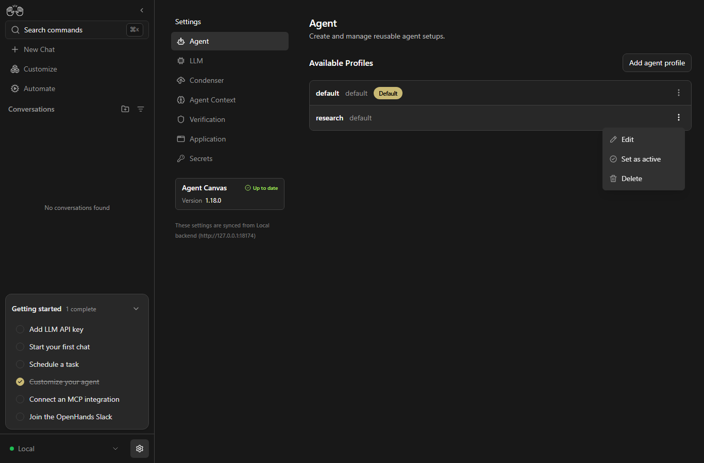
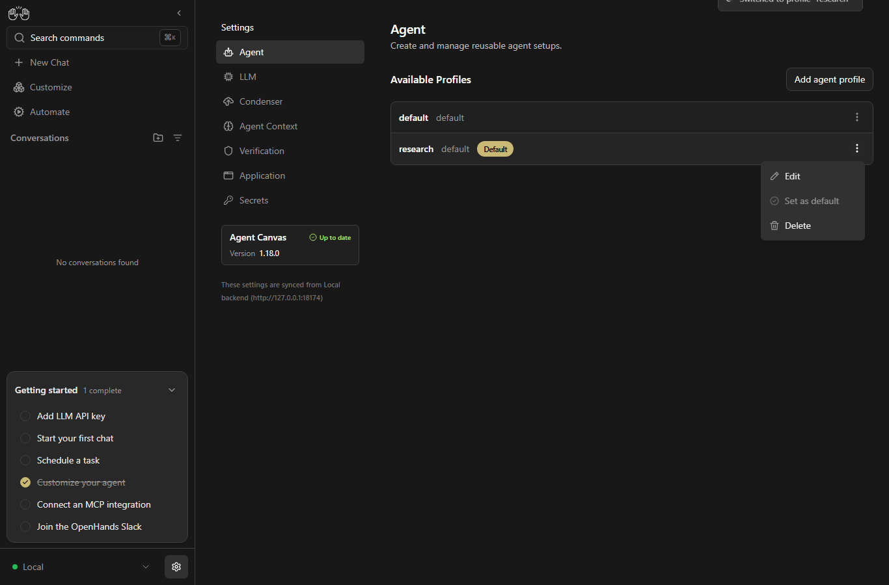

# Agent profile default label

Issue: https://github.com/OpenHands/OpenHands/issues/17426

The badge says **Default**, but the menu says **Set as active**. The fix changes the menu to **Set as default**, using the existing translation key.

## Reproduction

Checked by Codex on Windows on 2026-09-15, with Node 24.19.0, Agent Canvas 1.18.0 and the real Agent Server 1.46.0. No API mocks or LLM calls were used for these screenshots.

Before source: `82203bb1011cdf0e6eb318a32111806a6f6f734a`, with a clean tracked working tree. After source: the same base with the menu translation and manager test changes in this contribution. Backend state and setup were the same in both runs.

1. Run `npm ci`, then `npm run dev:minimal`. The launcher uses the pinned Agent Server release.
2. Skip onboarding and save analytics preferences. This check selected no analytics collection through the real UI.
3. Open Settings → Agent and have two profiles, `default` and `research`, with `default` selected. For these captures, `research` was created through `AgentProfilesClient.saveAgentProfile` with `agent_kind: "openhands"` and `llm_profile_ref: "default"`; no model credentials were needed.
4. Open the menu on `research`.
5. Before: **Set as active**. After: **Set as default**.
6. Click the action. The real Agent Server returned HTTP 200 and `agent_settings_applied: false`. The Default badge moved to `research`, and its Set as default action became disabled.

This run used `OH_CANVAS_SAFE_BACKEND_PORT=18174`, `OH_CANVAS_SAFE_VSCODE_PORT=18175`, and `VITE_FRONTEND_PORT=5174`. State and generated keys were isolated outside the checkout using `OH_CANVAS_SAFE_STATE_DIR`, `OH_SECRET_KEY_PATH`, and `OH_SESSION_API_KEY_PATH`. Telemetry was disabled with `VITE_DO_NOT_TRACK=1` and `DO_NOT_TRACK=1`.

## Before

## After

## After selecting research

## Checks

- Updated regression expectation failed against the original menu text, then passed with the fix.
- Three related profile suites: 41 tests passed.
- Additional static-server and manager recheck: 63 tests passed.
- Lint, translation completeness, app build, library build and `npm pack --dry-run`: passed.
- Full suite: stopped after about 25 minutes on this machine, so no full-suite pass is claimed. Two path assertions failed on both the changed code and unmodified base under Windows (`agent-server-adapter` and `stryker-diff`). A static-server failure in the full run did not recur on base or on the changed code.

The production change only replaces the menu's translation key. The activation callback and backend behavior are unchanged.
